# Project Title

Project Hub

## Overview

Project Hub is a project planning and management app designed to streamline your workflow and enhance team collaboration.

### Problem

In today's fast-paced business environment, project managers and teams often face significant challenges in organizing and executing projects efficiently. Common issues include disorganized task management. Therefore, a need exists for a comprehensive, user-friendly platform that bridges these gaps and enhances team collaboration, project visibility, and task management within a unified, intuitive interface.

### User Profile

- Project Managers:
  - Create a project, add team members
  - Create tasks, assign tasks
- Team Members:
  - Create tasks, update task status

### Features

- As a user, I want to be able to create an account.
- As a user, I want to be able to log in and log out of the application
- As a logged in user, I want to be able to create a project.
- As a logged in user (project creator), I want to be able to add team members to a project.
- As a logged in user, I want to be able to create tasks in a project that I am a part of.
- As a logged in user, I want to be able to assign created tasks to myself or other team members.

## Implementation

### Tech Stack

- React
- Nodejs
- MySql
- Express
- Client libraries:
  - react
  - react-router
  - sass
  - tailwindcss
  - axios
  - chakra-ui
  - @hello-pangea/dnd
- Server libraries:
  - knex
  - express
  - bcrypt
  - jwt

### APIs

- No external APIs will be used for the first sprint

### Sitemap

- Landing page
- Login page
- Signup page
- Project list page
- Add Project page
- Project Dashboard
  - Project Overview page
  - Project Team page
  - Task Board/List page
  - Edit Project page
- 404 page

**Installation Instructions**
- Clone the project from github: git clone https://github.com/Eloagbawe/project-hub.git
- Run npm install to install dependencies: npm install
- Create a .env file at the root of the folder and add the VITE_API_URL variable (api url from the backend) as specified in .env.example
- Run app: npm run dev

### Visuals

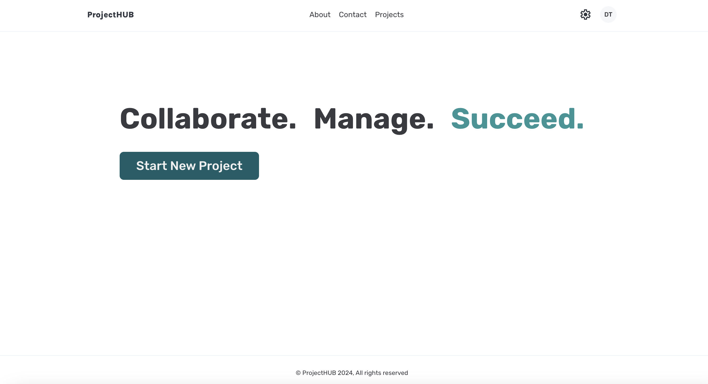
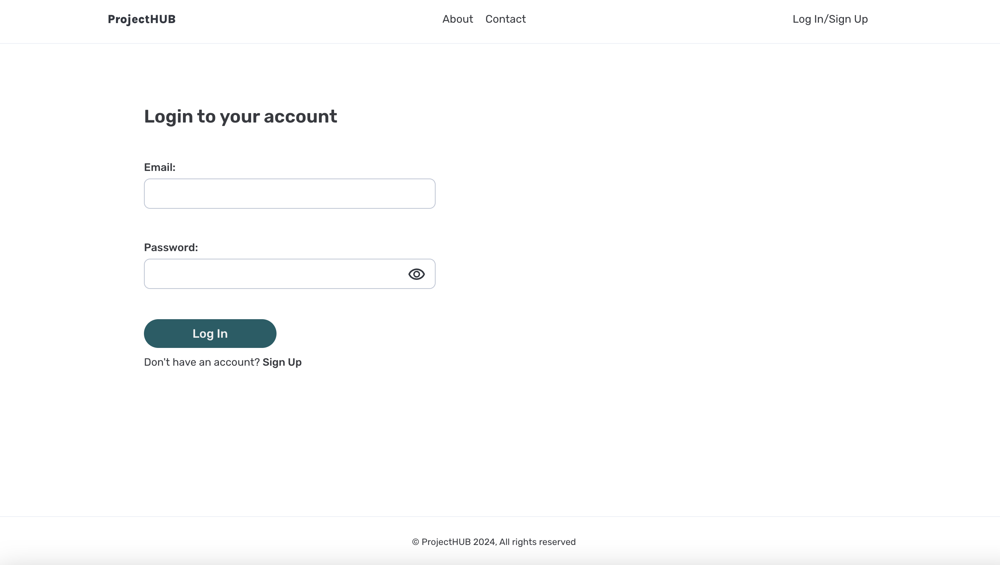
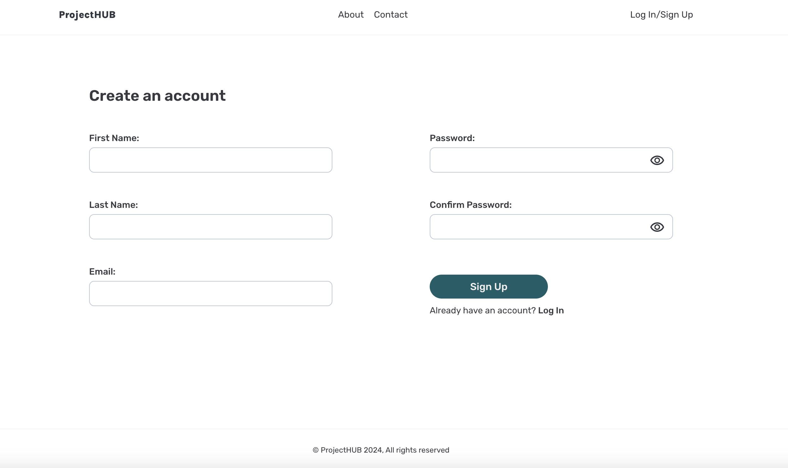
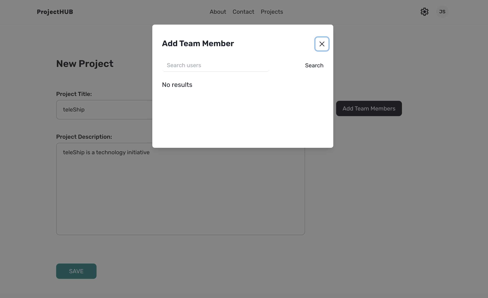
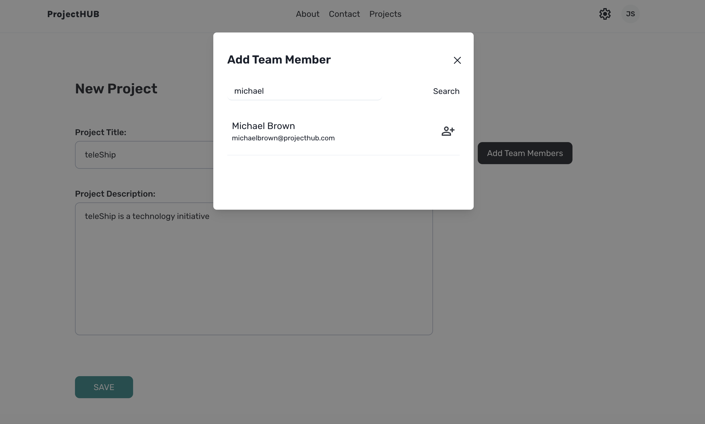
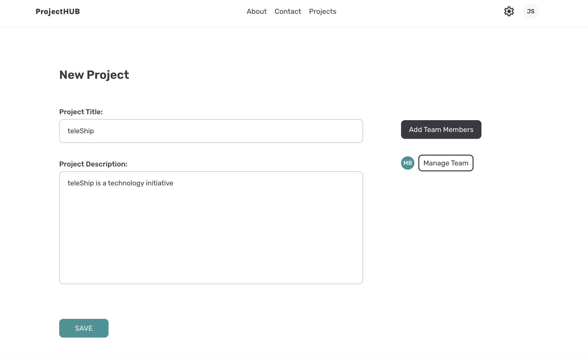
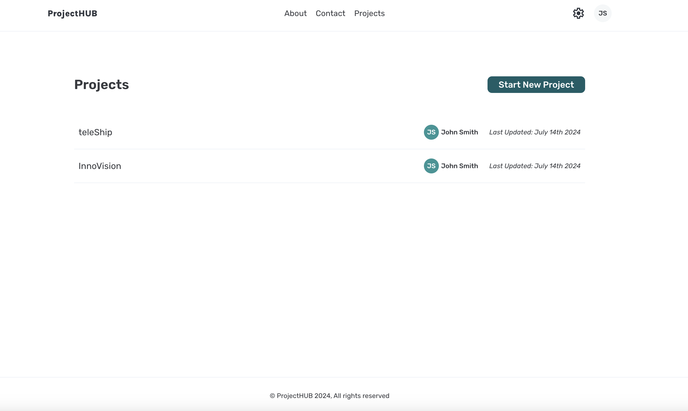
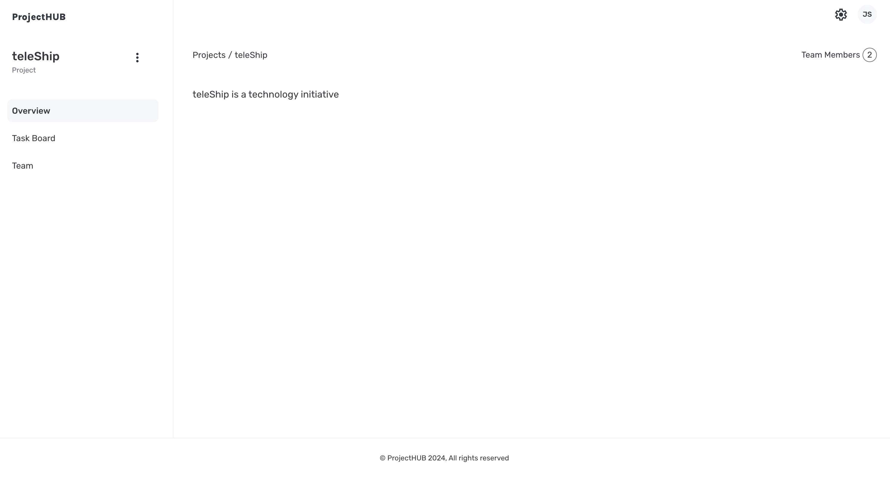
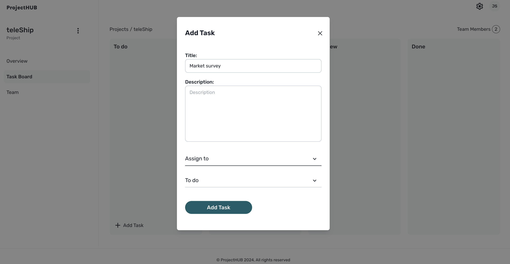
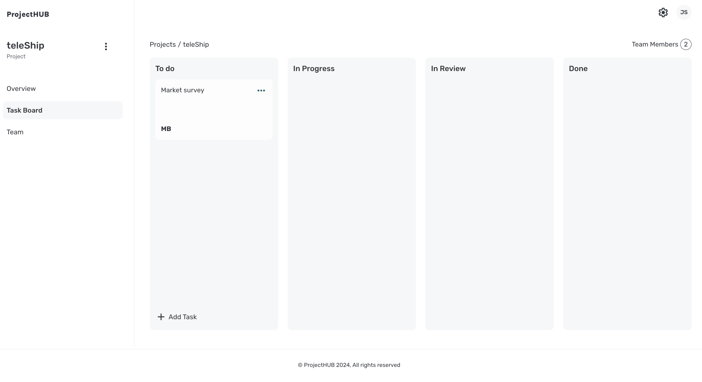
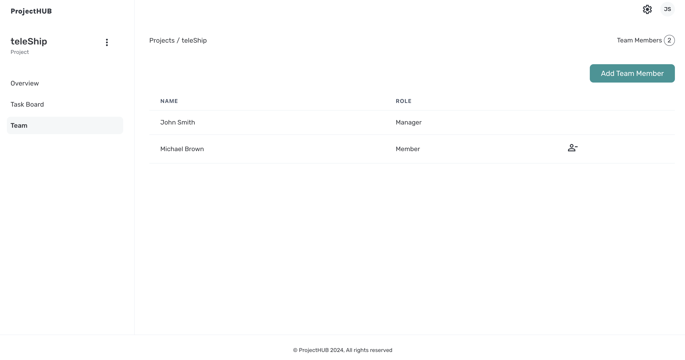
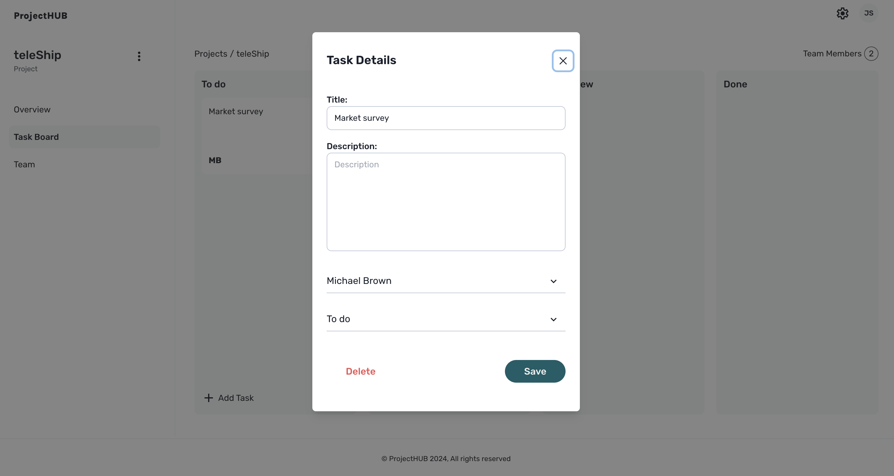
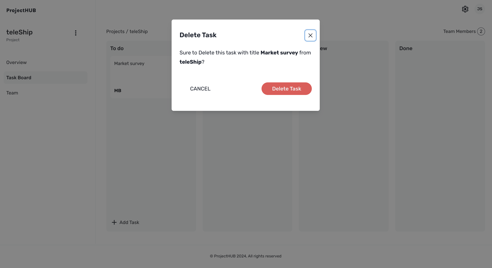
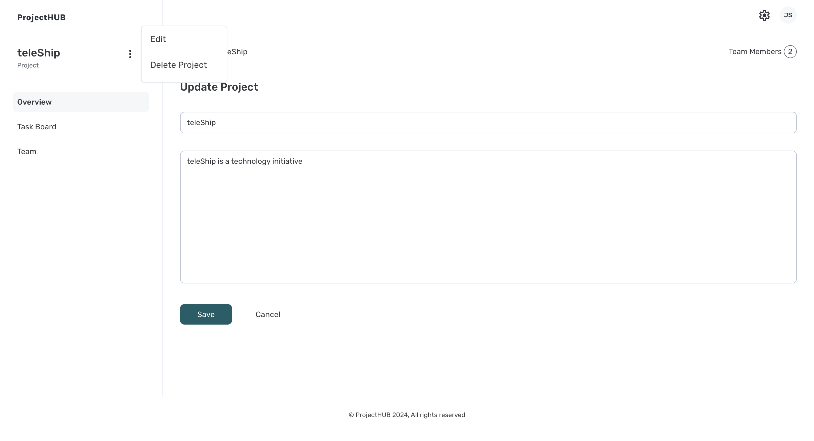
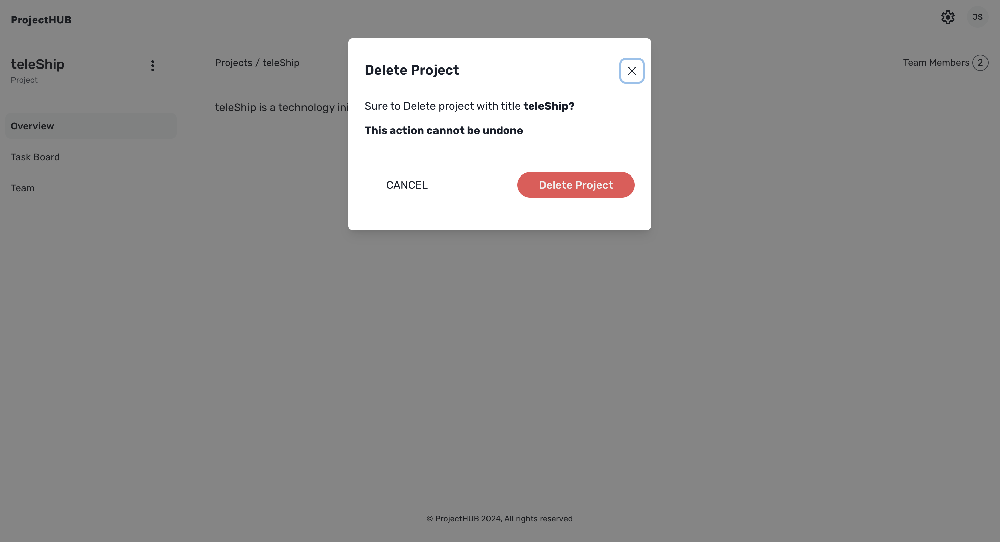
